## Cinématique

--

## Cinématique
_La cinématique du solide est l’étude des mouvements des corps
indépendamment des causes qui les provoquent._

---

## 1- Repères et coordonnées d’un point.
La position d’un solide dans l’espace est défini dans un système de __coordonnées cartésiennes__.

<iframe loading="lazy" style="border: 0px;" title="Vecteur position 3D" src="https://www.geogebra.org/material/iframe/id/hgzaek6x/width/400/height/400/border/888888/sfsb/true/smb/false/stb/false/stbh/false/ai/false/asb/false/sri/true/rc/false/ld/false/sdz/true/ctl/false" scrolling="no" width="400px" height="400px"> </iframe>

--

#### Coordonnées cartésiennes
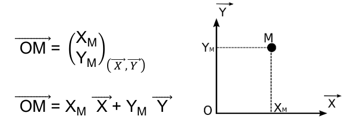

--

#### Coordonnées polaires
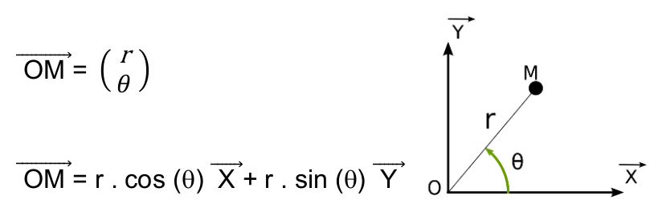

--

Les coordonnées polaires et cartésiennes sont donc liées par les relations :

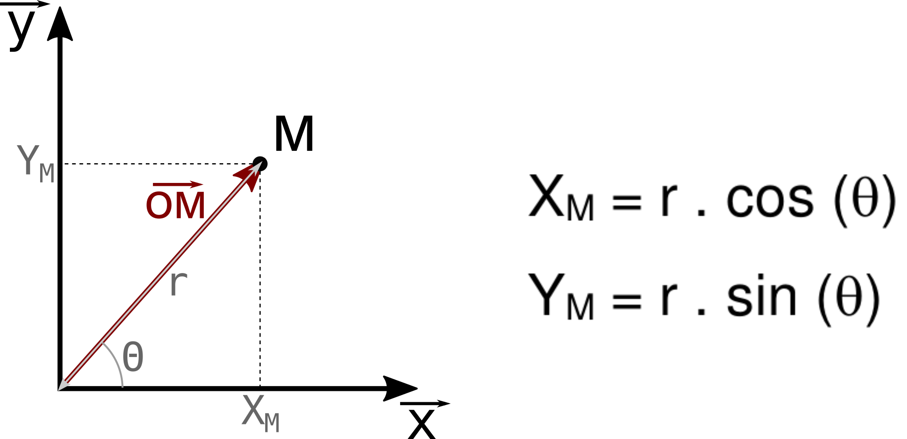

--

L’étude des mouvements nécessite d'utiliser plusieurs repères :
- un repère fixe servant de référence
- des repères mobiles

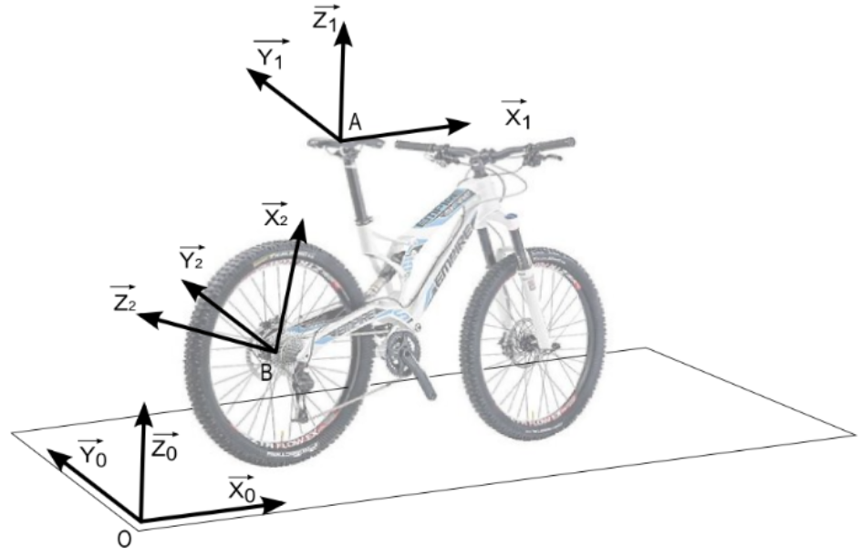

--

La caractérisation du mouvement dépendra l'évolution du repère mobile par rapport au repère fixe au court du temps.

<iframe width=1100 height=700 src="https://www.edumedia-sciences.com/fr/media/frame/938/?auth=10fa67347ae69ec4490fd876750605ba/43819" frameborder=0></iframe>

--

#### ⏯️ Déterminer le mouvement du repère mobile par rapport au repère fixe dans les cas suivants :

<iframe width=825 height=660 src="https://www.edumedia-sciences.com/fr/media/frame/476/?auth=e152df3c3480c7bfceacff965836ec1e/43819" frameborder=0></iframe>

|Cas N° | Repère fixe  | Repère mobile |
|----|-------|------|
|1| Sol |  Vélo|
|2   | Fourche avant | Roue avant |
| 3  | Roue arrière  | Sol|

---

## 2- Notion de trajectoire
La trajectoire d’un point par rapport à un repère est une courbe correspondant à la trace laissée par ce point lors de son déplacement.

--

#### ⏯️ Déterminer la trajectoire des points suivants en tenant compte du mouvement pris en compte :

[@Illustration des mouvements selon le repère fixe](https://www.edumedia-sciences.com/fr/media/476-relativite-du-mouvement?auth=e152df3c3480c7bfceacff965836ec1e/43819)

--

La trajectoire du point A appartenant à R1 par rapport à R0 :
TA∈1/0 : 

--

La trajectoire du point A appartenant à R1 par rapport à R0 :
TA∈1/0 : **Droite suivant x0**

--

La trajectoire du point A appartenant à R1 par rapport à R1 :
TA∈1/1 :

--

La trajectoire du point A appartenant à R1 par rapport à R1 :
TA∈1/1 : **Indéfinie (immobile)**

--

La trajectoire du point A appartenant à R1 par rapport à R2 :
TA∈1/2 : 

--

La trajectoire du point A appartenant à R1 par rapport à R2 :
TA∈1/2 : **Cercle de centre B et de rayon BA**

--

- La trajectoire du point A appartenant à R1 par rapport à R0 :
TA∈1/0 : **Droite suivant x0**
- La trajectoire du point A appartenant à R1 par rapport à R1 :
TA∈1/1 : **Indéfinie**
- La trajectoire du point A appartenant à R1 par rapport à R2 :
TA∈1/2 : **Cercle de centre B et de rayon BA**

---

## 3- Les mouvements

**Tous les mouvements** d’un solide dans l’espace peuvent être
décomposés en 6 mouvements élémentaires :

- 3 translations rectilignes suivant les trois axes.
- 3 rotations autour des trois axes.

--

On les appelle des **degrés de liberté**. Au maximum, un solide peut avoir 6 degrés de liberté (3 translations et trois rotations)

--

### Les mouvements de translation

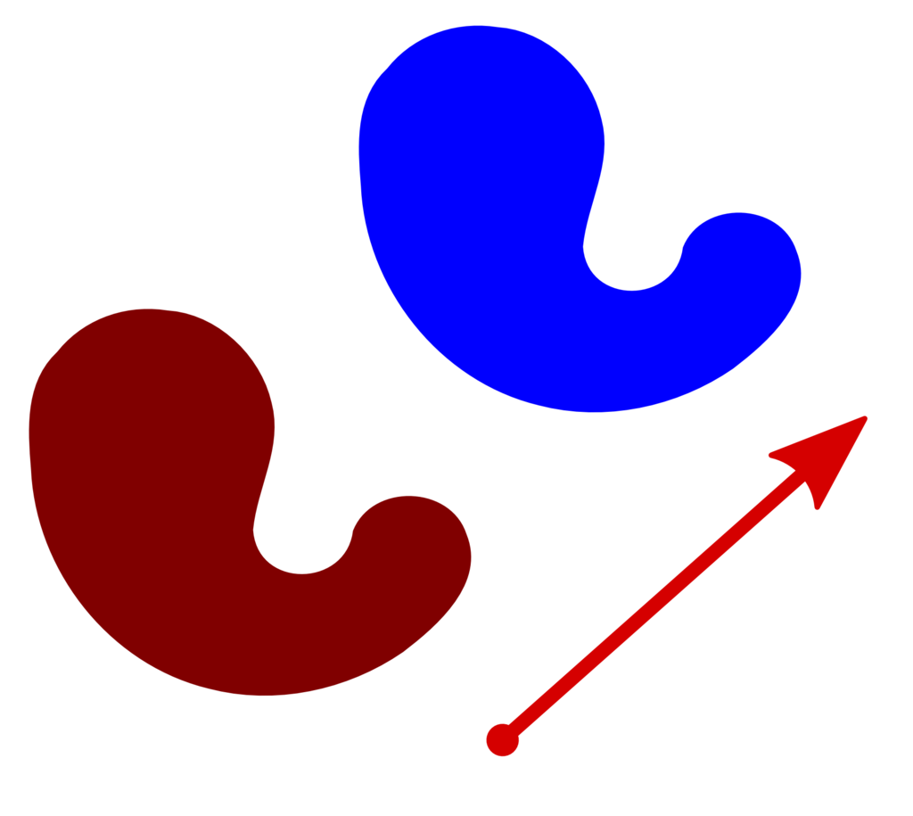

--

- Un solide est en translation si le repère mobile associé au solide reste parallèle au repère fixe de référence.

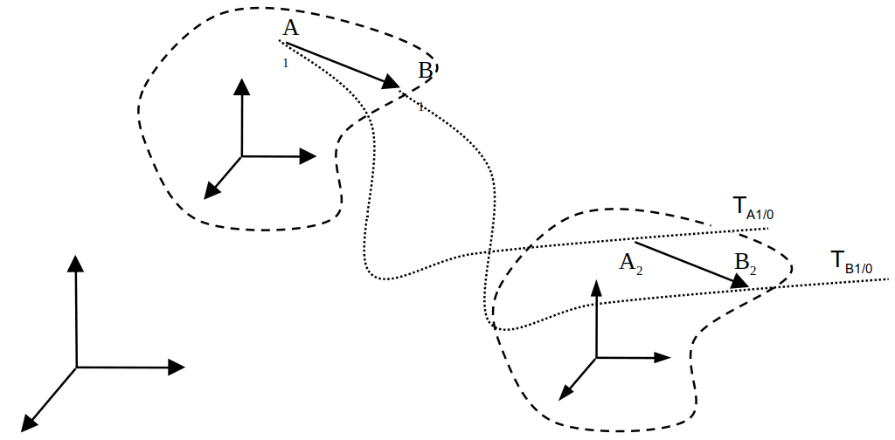

--

Pour modéliser (représenter) sur un graphique un mouvement de translation rectiligne suivant une direction, nous allons utiliser la liaison glissière :

--

#### Les mouvements de translation particuliers

| Translation rectiligne | Translation circulaire |
|-------------|:-----------:|
| 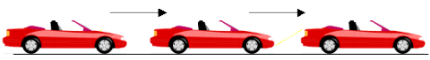 |  |
| [@Translation rectiligne](https://www.edumedia-sciences.com/fr/media/532-mouvement-rectiligne?auth=5e82da39db54a1a7b6b50ddf9c56de9a/43819) | [@Translation circulaire](https://www.edumedia-sciences.com/fr/media/60-translation-circulaire?auth=ce80069ad2be7f1e1a6198cbd457e9f1/43819)

--

### Les mouvements de rotation autour d’un axe fixe.

- Un solide (1) est en mouvement de rotation, si ce solide possède un point fixe A ou un axe fixe (AB) au cours du mouvement.

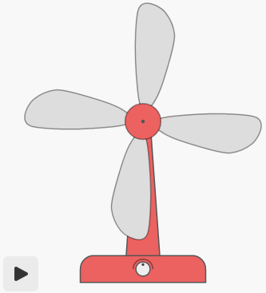

[@Mouvement de rotation](https://rvdrou.github.io/animations/gears/?group=2)

--

Pour modéliser (représenter) sur un graphique un mouvement de rotation autour d'un axe, nous allons utiliser la liaison pivot :

---

## Caractéristiques des vecteurs vitesses selon les mouvements

--

### Définition de la vitesse
- La vitesse linéaire (notée V) est la distance parcourue par un objet par unité de temps.
- L’unité de la vitesse est « mètres/seconde » (**m/s**)

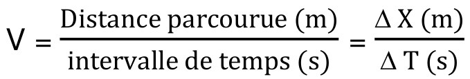

--

- La vitesse angulaire (notée ω) est l’angle parcouru par un objet par unité de temps.
- L’unité de la vitesse est « radians/seconde » (**rad/s**).
- Rappel : **1 tour = 360° = 2.π rad**

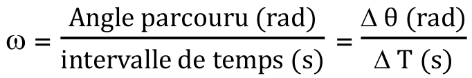

[@Vitesse angulaire](https://rvdrou.github.io/animations/gears/?group=2)

--

### Notion de vitesse instantanée

- La vitesse moyenne : déplacement par le temps lors d'un'intervalle de temps ΔT quelconque
- La vitesse instantanée : vitesse moyenne pour Δt qui tend vers 0s (temps extrèmement court)

<iframe width=1100 height=880 src="https://www.edumedia-sciences.com/fr/media/frame/557/?auth=6db0403a561b1b3e0a7402dcb98dac69/43819" frameborder=0></iframe>

--

### Champ des vecteurs vitesse

- Désigne l’ensemble des vecteurs vitesse linéaire de chaque point de ce solide à un instant **t**.
- Exemple : Le champ des vecteurs vitesse du rotor d’un hélicoptère

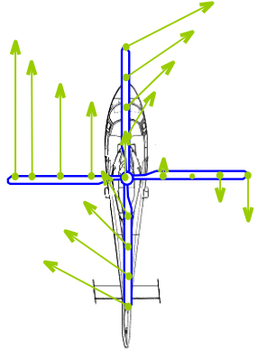

--

#### Caractéristiques du vecteur vitesse lors d'une **translation**

- **Direction** : Colinéaire à la trajectoire du point
- **Sens** : Celui du mouvement

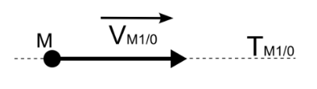

--

- **Norme** : La vitesse de translation du solide 1/0 -> Le champ des vecteurs vitesse est uniforme.

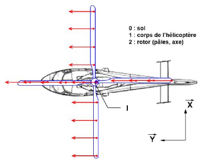

--

#### Caractéristiques du vecteur vitesse lors d'une **rotation**

- **Direction** : Tangente à la trajectoire du point M
- **Sens** : Celui du mouvement

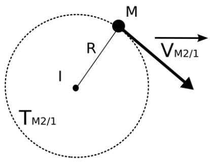

--

- **Norme** :

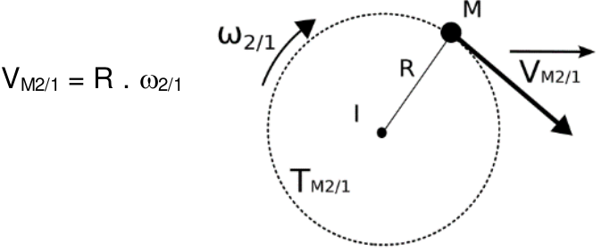

[@Mouvement de rotation](https://rvdrou.github.io/animations/gears/?group=2)

--

La vitesse du solide 2/1 (pales par rapport au cockpit) dépend du point considéré et n'est donc pas uniforme.

---

#### Composition des vecteurs vitesses

<iframe width=1100 height=880 src="https://www.edumedia-sciences.com/fr/media/frame/526/?auth=dc4e6dfb45f75fcd5629e7283ddb6483/43819" frameborder=0></iframe>

--

- Cas de l'hélicoptère -> 
On peut en conclure que la vitesse de la pale par rapport au sol en un point est égale à la vitesse de la pale par rapport au cockpit **plus** la vitesse du cockpit par rapport au sol.

---

### Torseur cinématique
- Tout mouvement peut être décrit par deux vecteurs
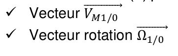

--

- le torseur cinématique représente ces deux vecteurs dans la même écriture

