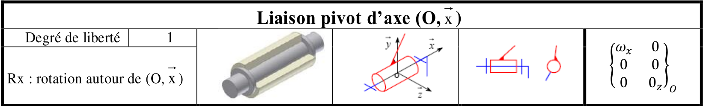
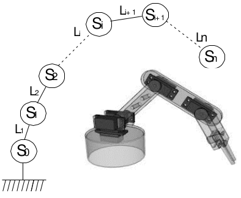
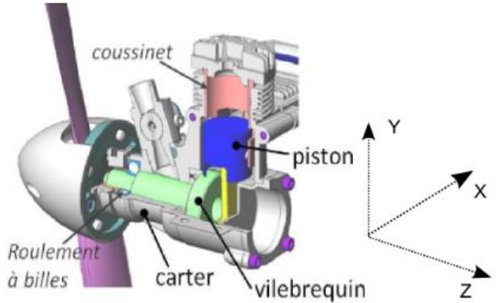
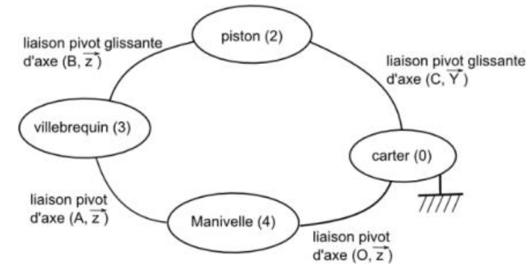
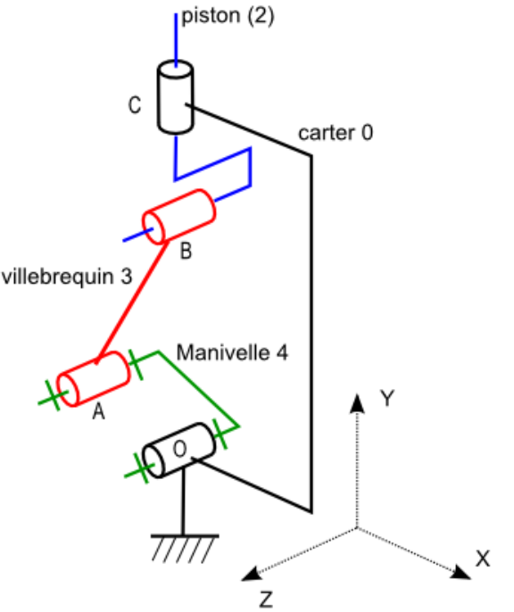

## Liaisons cinématiques

---

### 1- Liaisons entre solides
- Une liaison entre deux solides 1 et 2 est créée par le contact d'une surface du solide 1 sur une surface du solide 2
- Il existe 6 déplacements élémentaires indépendants (6 degrés de liberté.) ➔ Tx, Ty, Tz et Rx, Ry, Rz

--

### 2- Liaisons cinématiques normalisées
Il existe 10 liaisons élémentaires. Les trois suivantes sont à connaître parcoeur.

--

--

--

---

### 3- Classe d’équivalence cinématique.
- Une **classe d’équivalence** cinématique (aussi appelé **groupe cinématique**) est un ensemble de solides qui n’ont aucun mouvement relatif.
- Dans un mécanisme, on commence par définir les classes d’équivalence puis, on recherche les liaisons entre ces classes d’équivalence.

---

### 4- Graphe de liaison
Un graphe des liaisons énumère l'ensemble des classes d'équivalence d'un mécanisme et ses liaisons.

--

- Classe d'équivalences sont représentées par des cercles 
- Les liaisons cinématiques sont représentées par des traits entre deux cercles.

--

#### Chaine ouverte

--

#### Chaîne fermée

--

#### Chaîne complexe

---

### 5- Représentation schématique des mécanismes
- Le schéma cinématique d’un mécanisme est un modèle filaire du mécanisme utilisant les symboles normalisés des liaisons.
- Les groupes cinématiques sont représentés très schématiquement (souvent un simple trait).
- Ce modèle est utile tant au niveau de la conception que de l’analyse (cinématique, statique, trajectoire,....)

--

#### Exemple : Moteur d'aéromodélisme

--

#### Exemple : Graphe des liaisons

--

#### Schéma cinématique en 2D

--

#### Schéma cinématique en 3D

---

### 6- Fermeture géométrique des mécanismes à chaînes fermés.

- Dans un système en chaîne fermée, il existe une relation vectorielle liant les
points caractéristiques de chaque solide : 

